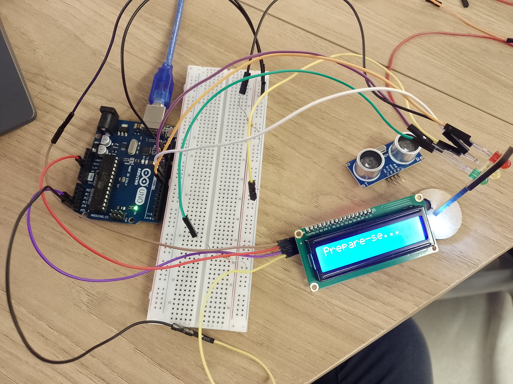

# Projeto do Semáforo

&ensp; Neste repositório está exibido o projeto requerido pela atividade "Semáforo offline" do Inteli em que se constrói um semáforo de pedestres. Ele contém
- Duas fotos do circuito
- Um vídeo do projeto funcionando
- O código utilizado para o projeto
- Avaliação de um par com base nos critérios do Inteli

&ensp; As fotos do circuito podem ser vistas abaixo:
 

  Figura 1 - Visão vertical do circuito

  

  Fonte: Material produzido pelo autor (2024).

 

  Figura 2 - Visão oblíqua do circuito

  

  Fonte: Material produzido pelo autor (2024).

&ensp; Além dos tempos determinados para cada led, o projeto apresentado implementa o uso de um LCD para indicar que o pedestre pode passar e o uso de ponteiros para apontar para o local na memória da led_verde.

## Processo

&ensp; Para montar esse circuito utilizou-se os seguintes componentes:

    Tabela 1 - Tabela de Componentes

| Nome do Componente | Quantidade |
|---------------------|--------------------|
| Jumper Macho-Fêmea | 7 |
| Jumper Macho-Macho | 2 |
| Jumper Fêmea-Fêmea | 3 |
| Resistores | 3 |
| Placa LCD | 1 |
| Led | 3 |
| Protoboard | 1 |
| Placa Arduino Uno | 1 |

  Fonte: Material produzido pelo autor (2024).

&ensp; Com esses materiais, pode-se:
1. Conectar o GND do arduino na protoboard;
2. Conectar três resistores na linha do GND;
3. Conectar os resistores no led com jumpers;
4. Conectar os LEDs nas portas 8, 9 e 10 do arduino;
5. Conectar o LCD no arduino e no GND da protoboard;
